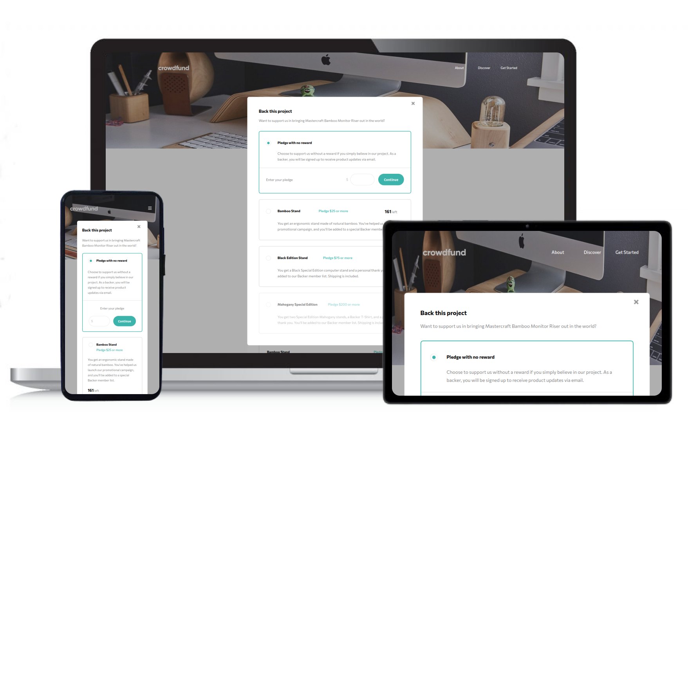

# Frontend Mentor - Crowdfunding product page solution

This is a solution to the [Crowdfunding product page challenge on Frontend Mentor](https://www.frontendmentor.io/challenges/crowdfunding-product-page-7uvcZe7ZR). Frontend Mentor challenges help you improve your coding skills by building realistic projects. 

## Table of contents

- [Overview](#overview)
  - [The challenge](#the-challenge)
  - [Screenshot](#screenshot)
  - [Links](#links)
- [My process](#my-process)
  - [Built with](#built-with)
  - [What I learned](#what-i-learned)
  - [Continued development](#continued-development)
  - [Useful resources](#useful-resources)
- [Author](#author)

## Overview

### The challenge

Users should be able to:

- View the optimal layout depending on their device's screen size
- See hover states for interactive elements
- Make a selection of which pledge to make
- See an updated progress bar and total money raised based on their pledge total after confirming a pledge
- See the number of total backers increment by one after confirming a pledge
- Toggle whether or not the product is bookmarked

### Screenshot

### Links

- Solution URL: [Add solution URL here](https://www.frontendmentor.io/solutions/reactjs-wit-styledcomponents-_kXhQLo0l)
- Live Site URL: [Add live site URL here](https://frontendmentorchallenge-crowfundingproductpage.vercel.app/)

## My process

### Built with

- Semantic HTML5 markup
- CSS - Flexbox
- Mobile-first workflow
- [React](https://reactjs.org/) - JS library
- [Styled Components](https://styled-components.com/) - For styles
- [Figma](https://www.figma.com/) - For checking the design

### What I learned

- In this challenge I have learned how to make customized radio inputs, taking care accessibility issues.
- I deeped in some of the main characteristics of styled-components to customize components.
- I discovered how to use the useRef hook to check if a click was made outside a component (to close a modal or a navigation menu).

### Continued development

What's next? 
- I want to focus in the fetch Api. 
- I will implement a dark/light switcher with styled-component.
- I need to learn more about the useRef hook.

### Useful resources

- [Capturing click outside a component with useRef hook](https://medium.com/@pitipatdop/little-neat-trick-to-capture-click-outside-with-react-hook-ba77c37c7e82) - This helped me to implement the useRef hook to close the modal and the navigation menu if a click was made outside the component.

## Author

- Website - [Jorge Flagel](jorgeflagel.vercel.app/)
- Frontend Mentor - [@Jorge Flagel](https://www.frontendmentor.io/profile/jorgeflagel/solutions)
- LinkedIn - [@Jorge E. Flagel](https://www.linkedin.com/in/jorge-e-flagel-b2b372207/)